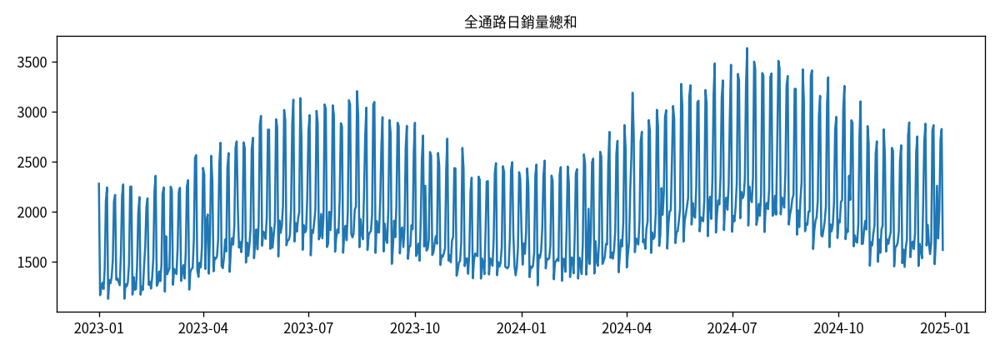
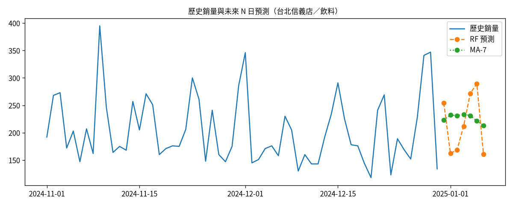
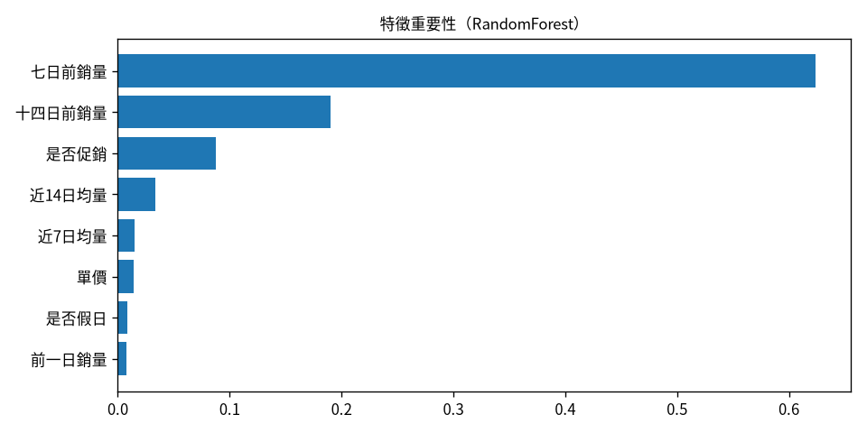
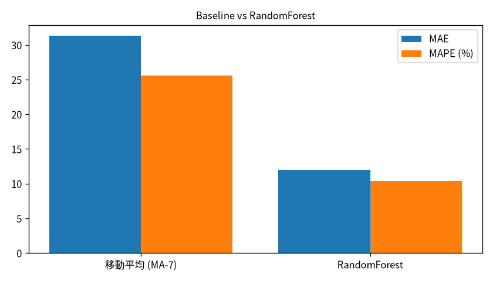

# Retail Ops DSS｜零售營運決策支援原型

[](https://github.com/Miiduoa/retail-ops-dss/actions/workflows/verify.yml)

**零售營運原型：預測建議＋角色權限＋操作稽核** — 個人作品（非課內專題）｜MIT License

作者：顧晉瑋（靜宜大學資訊管理學系）｜Contact: demohan513@gmail.com

## 這個專案在做什麼

我先用合成日銷量做銷量預測與補貨／人力文字建議，後來把重點改成：**誰能做什麼、能碰哪些門市資料、做過的事能不能追回來**。技術棧是 Python、pandas、scikit-learn、Streamlit、SQLite；權限表與測試情境由我設計，並以 GitHub Actions 自動重跑驗證。

## 30 秒 Demo 路徑

1. **預測頁**：選門市與品類，看 MA-7 與 Random Forest 的預測結果。
2. **操作補貨**：用 `operator.s01` 提出補貨，觀察門市範圍與高影響操作的再驗證。
3. **切換帳號**：改用 `viewer.s02` 嘗試寫入，確認預設拒絕。
4. **稽核頁**：用 `admin` 查看成功／拒絕事件並匯出紀錄。

| 審查重點 | 直接看 |
|---|---|
| 存取控制與權限表 | `src/access/policy.py` |
| UI 權限與再驗證 | `src/ui_security.py` |
| 自動驗證（24 個測試） | `tests/test_access_control.py`、`scripts_verify.py` |
| 實際介面 | [docs/screenshots](docs/screenshots/) |
| 架構說明 | [docs/架構說明.md](docs/架構說明.md) |

## 存取控制與操作稽核

| 做了什麼 | 內容 |
|----------|------|
| 角色權限 | 分成檢視（viewer）、門市營運（operator）、管理者（admin）。每個動作先查角色能不能做；`policy.py` 權限表裡沒有列的動作一律拒絕（預設拒絕）。 |
| 資料範圍 | 門市營運只能看、只能改被指派的門市；跨店操作會被擋下並寫入紀錄。 |
| 高影響操作再驗證 | 大量補貨核准、高影響庫存調整、系統設定變更等，須在約 5 分鐘內再驗證身分才放行。 |
| 操作紀錄 | 成功與被拒絕的操作都寫進 SQLite；以 BEFORE UPDATE／DELETE trigger 做成只能新增、不能改刪。管理者可篩選與匯出。 |
| 測試 | 24 個測試（以存取控制為主），放在 `tests/test_access_control.py`；每次更新由 GitHub Actions 自動重跑，2026-10-06 驗證通過。 |

想自己確認的話，照下方步驟在本機執行後：用 `viewer.s02` 試著改庫存會被拒絕；用 `operator.s01` 替別家門市補貨會被拒絕並留下紀錄；再用 `admin` 打開稽核頁，就看得到剛才成功和被拒絕的事件。

## 截圖

| 資料概覽 | 預測與建議 |
|:---:|:---:|
|  |  |
| **特徵重要性** | **模型評估** |
|  |  |

## 資料

| 項目 | 說明 |
|------|------|
| 類型 | 程式產生的合成零售日銷量（4 門市 × 4 品類 × 約兩年日銷量） |
| 產生 | `python generate_data.py`（固定 `SEED=42`，可重現） |
| 輸出 | `data/retail_daily_sales.csv`（repo 已附一份預產樣本） |

## 方法（簡述）

1. **特徵**：lag 1/7/14、滾動均值／標準差、星期／週末／假日、促銷、單價、月份
2. **Baseline**：7 日移動平均（MA-7）
3. **進階**：`RandomForestRegressor`（可看特徵重要性）
4. **評估**：最後 60 日依時間切分；rolling one-step-ahead，只用預測日前已觀測的歷史；缺值填補統計只由訓練區間估計
5. **決策**：依預測產生補貨量與人力工時的規則型文字建議
6. **存取控制**：預測建議進入寫入流程前，先過權限、門市範圍與再驗證；結果寫入操作紀錄

訓練結果快取於 `models/rf_bundle.joblib`（首次載入 App 時自動訓練；已列入 `.gitignore`）。

## 如何執行

```bash
git clone https://github.com/Miiduoa/retail-ops-dss.git
cd retail-ops-dss

python -m venv .venv
source .venv/bin/activate          # Windows: .venv\Scripts\activate
pip install -r requirements.txt

python generate_data.py            # 產生／覆寫合成資料
streamlit run app.py
```

瀏覽器開啟終端機提示的本機網址（預設 `http://localhost:8501`）。首次啟動會種子合成帳號與空的稽核庫（`data/ops_control.db`，不進版控）。

### Demo 帳號（合成）

| 帳號 | 密碼 | 角色 | 資料範圍 | 適合演示 |
|------|------|------|----------|----------|
| `operator.s01` | `demo-op-s01` | 門市營運 | 僅 S01 台北信義店 | 單店隔離、補貨／庫存 |
| `operator.north` | `demo-op-north` | 門市營運 | S01、S04（北區） | 同角色、不同範圍 |
| `operator.s03` | `demo-op-s03` | 門市營運 | 僅 S03 高雄夢時代店 | 與 S01 對照，互不可見 |
| `viewer.s02` | `demo-view-s02` | 檢視者 | 僅 S02 台中逢甲店 | 預設拒絕寫入／核准 |
| `admin` | `demo-admin-2026` | 系統管理者 | 全門市（`*`） | 稽核儀表、匯出、帳號與設定 |

側欄可快速填入帳號。高影響操作會要求再輸入密碼（預設 5 分鐘內有效）。側欄「Demo：模擬非營業時間」方便在白天也能看到風險旗標。

### Demo 操作路徑

1. 用 `operator.s01` 登入 → 預測頁只能選信義店 → 提出或核准補貨。
2. 勾選「模擬非營業時間」再操作一次；必要時用同一密碼再驗證。換 `operator.s03` 確認看不到信義店。
3. 用 `admin` 開「操作稽核」：看近 24h 拒絕與敏感成功、篩選、匯出 CSV。再用 `viewer.s02` 嘗試核准，應被拒絕並入稽核。

### 快速驗證（非互動）

```bash
python generate_data.py
python scripts_verify.py
python -m unittest tests.test_access_control -v
```

## 介面功能

| 頁面 | 內容 | 誰看得到 |
|------|------|----------|
| 資料概覽 | 資料規模、可見範圍趨勢、品類結構 | 有 `dashboard.read` 且僅自己的門市 |
| 預測與決策建議 | 選門市／品類、未來 N 日預測、補貨／人力建議、提出／核准補貨 | 門市清單已過濾；寫入另要 `reorder.*` |
| 庫存與補貨作業 | 庫存調整、補貨單核准／駁回 | 敏感動作可要求再驗證 |
| 模型評估對照 | MA-7 與 RandomForest 的時間切分評估 | `eval.read` |
| 操作稽核 | 篩選、失敗授權、敏感成功、匯出 CSV | `audit.read`／`audit.export`（管理者） |
| 帳號與設定 | 角色、門市範圍、高影響門檻、營業時段 | `user.admin`／`settings.admin` |

## 目錄結構

```text
retail-ops-dss/
├── app.py                 # Streamlit 入口
├── generate_data.py       # 合成資料一鍵產生
├── scripts_verify.py      # 非互動驗證（含授權／稽核測試）
├── requirements.txt
├── LICENSE                # MIT
├── README.md
├── data/                  # CSV；ops_control.db 於本機種子
├── models/                # 模型快取（.gitkeep；*.joblib 不進版控）
├── src/
│   ├── data_loader.py
│   ├── features.py
│   ├── models.py
│   ├── explain.py
│   ├── recommend.py
│   ├── ui_security.py     # 登入、風險、作業／稽核／設定頁
│   └── access/            # 政策引擎、稽核、種子帳號
├── tests/
│   └── test_access_control.py
└── docs/
    ├── 備審專題說明.md
    ├── 架構說明.md
    └── screenshots/
```

## 授權

[MIT License](LICENSE) — Copyright (c) 2026 顧晉瑋
