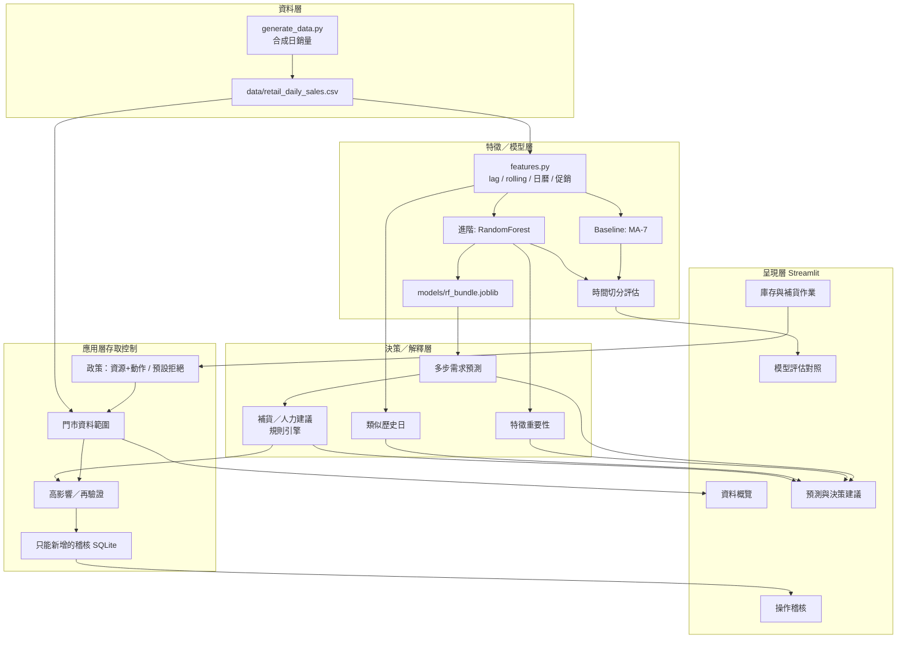

# 系統架構說明

## 總覽

本原型採「資料層 → 特徵／模型層 → 決策／解釋層 → 應用層存取控制 → 呈現層」架構。後半段的重點是角色權限、門市資料範圍、高影響操作再驗證與只能新增的操作紀錄。

## 架構圖（Mermaid）

## 資料流

1. 啟動 App → 合成帳號登入（失敗亦寫稽核）→ 依門市範圍載入 CSV
2. 首次載入訓練 MA 與 RandomForest，結果寫入 joblib 快取
3. 使用者選可見門市／品類與預測天數 → 遞迴多步預測
4. 以特徵重要性與類似歷史日說明「為什麼」
5. 規則引擎依預測量與庫存產出補貨／人力文字建議
6. 提出／核准補貨或調整庫存時：權限 → 範圍 → 再驗證 → 通過才寫入；結果追加進稽核
7. 評估頁對照 baseline 與進階模型（時間切分）
8. 管理者可篩選、匯出稽核（失敗授權與敏感成功）

## 模組對應

| 模組 | 職責 |
|------|------|
| `generate_data.py` | 可重現合成資料 |
| `src/data_loader.py` | 載入與維度清單 |
| `src/features.py` | 特徵工程 |
| `src/models.py` | 訓練、評估、預測、快取 |
| `src/explain.py` | 重要性與歷史類比 |
| `src/recommend.py` | 補貨／人力建議 |
| `src/access/policy.py` | 角色權限表、預設拒絕、再驗證條件 |
| `src/access/` | 政策引擎、稽核（SQLite trigger）、種子帳號 |
| `src/ui_security.py` | 登入、再驗證、作業／稽核／設定頁 |
| `app.py` | Streamlit 介面 |
| `tests/test_access_control.py` | 24 個測試（以存取控制為主） |

## 設計取捨

- **選 RandomForest**：依賴輕、訓練快、原生特徵重要性，適合現場 Demo
- **規則型建議**：與預測模型分開，方便說明「DSS = 模型 + 管理邏輯」
- **應用層授權／稽核**：補貨與庫存必須有權限、有範圍、有紀錄才做得到
- **合成資料**：一鍵重現、無第三方授權爭議；之後可置換真實資料
