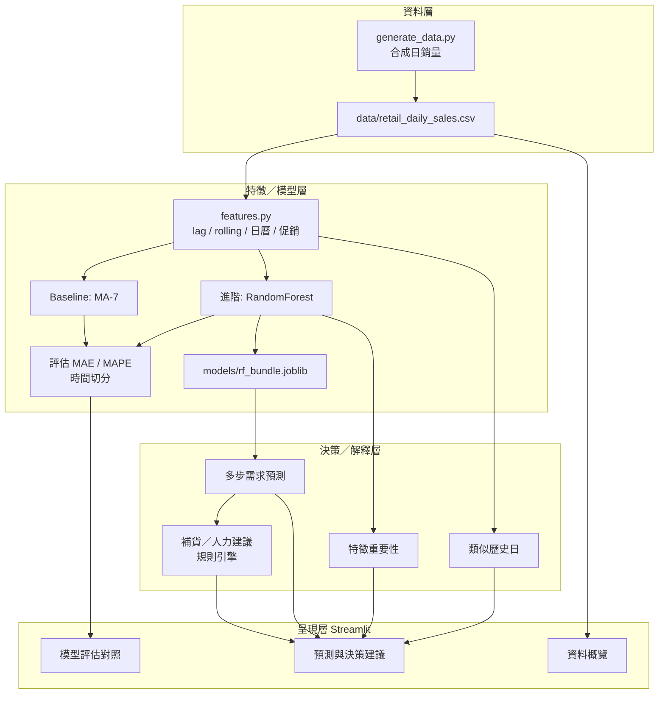

# 系統架構說明

## 總覽

本原型採「資料層 → 特徵／模型層 → 決策／解釋層 → 呈現層」四層架構，便於備審口試時對照說明。

## 架構圖（Mermaid）

## 資料流（口試可用口述稿）

1. 啟動 App → 載入 CSV（若無則自動產生）
2. 首次載入訓練 MA 與 RandomForest，結果寫入 joblib 快取
3. 使用者選門市／品類與 horizon → 遞迴多步預測
4. 以特徵重要性與類似歷史日說明「為什麼」
5. 規則引擎依預測量與庫存產出補貨／人力文字建議
6. 評估頁對照 baseline 與進階模型之 MAE／MAPE

## 模組對應

| 模組 | 職責 |
|------|------|
| `generate_data.py` | 可重現合成資料 |
| `src/data_loader.py` | 載入與維度清單 |
| `src/features.py` | 特徵工程 |
| `src/models.py` | 訓練、評估、預測、快取 |
| `src/explain.py` | 重要性與歷史類比 |
| `src/recommend.py` | 補貨／人力建議 |
| `app.py` | Streamlit 介面 |

## 設計取捨

- **選 RandomForest**：依賴輕、訓練快、原生特徵重要性，適合備審現場 Demo
- **規則型建議**：刻意與預測模型分離，凸顯「DSS = 模型 + 管理邏輯」
- **合成資料**：保證一鍵重現與無授權爭議；研究階段可置換真實資料驗證外推能力
